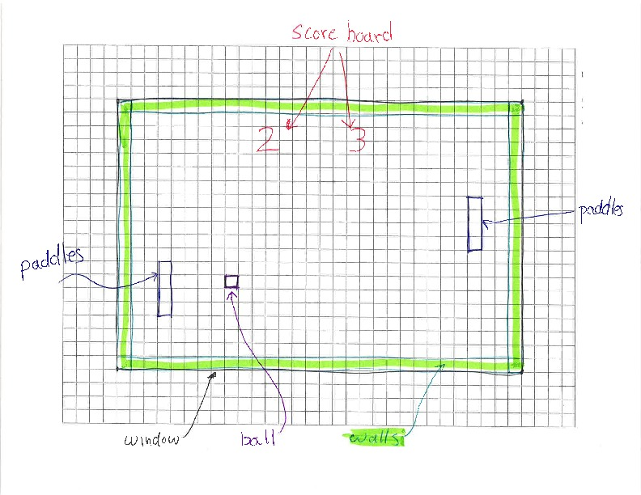

# Pong

## Assignment

Your assignment is to create a program using Python and Pygame that allows two
users to play Pong, using the architecture listed below.

This is a sketch of the active elements you will be creating
for this project:

## Part 1

Before moving on to part 2, you should complete part 1 of this assignment in
Code Grinder. Copy your solution of the ball class (`ball.py`) here in part 2 so
that the game is playable once you have completed the other classes.

## Part 2

This part of the assignment requires the addition of classes for `Paddle`,
`Wall`, `ScoreBoard` and `Pong`.

Each of the classes has required data members and methods.  The updated
[UML Diagram](pong_all_UML.pdf) contains all of the classes and their
required methods.  Not all data members or methods will be discussed below.
If you have questions, ask.

<object data="pong_all_UML.pdf" type="application/pdf" width="700px" height="700px">
    <embed src="pong_all_UML.pdf">
        This browser does not support PDFs. Please download the PDF to view it: <a href="pong_all_UML.pdf">Download PDF</a>.

    </embed>
</object>

### `Paddle` class

*Paddle Data Members*

#### `mX` and `mY`

This is the position of the top-left corner of the paddle, measured in pixels.  The values may be floating point numbers.

#### `mWidth` and `mHeight`

This is the horizontal and vertical size of the paddle's rectangle, measured in pixels.

#### `mSpeed`

This is the vertical speed of the paddle, measured in pixels per second.

#### `mMinY` and `mMaxY`

These describe the position of the top and bottom walls.  The paddle may not cross into either wall.

*Paddle Methods*

#### `__init__(x,y,width,height,speed,min_y,max_y)`

Initialize the paddle data members from the parameters.  `min_y` and `max_y`
refer to the top and bottom of the field of play.

#### Getters

Implement the getters.

#### `getRightX()`

Returns the x coordinate of the right side of the paddle.

#### `getBottomY()`

Returns the y coordinate of the bottom of the paddle.

#### `setPosition(y)`

Updates the y position of the paddle.  If the new y position would cause
the top of the paddle to go into the top wall or the bottom of the paddle
to go int the bottom wall, do not make any changes.

#### `moveUp(dt)`

Updates the y position of the paddle based on the time `dt`, and the paddle's
speed.  If the paddle would move into the top of the allowed region, stop
at the top.

#### `moveDown(dt)`

Updates the y position of the paddle based on the time `dt`, and the paddle's
speed. If the paddle would move into the bottom of the allowed region, stop
at the bottom.

#### `draw(surface)`

Uses Pygame to draw the rectangle for the paddle. There are no unit tests for this
method.  It will be verified during the pass-off of the full game.

### `Wall` class

*Wall Data Members*

#### `mX` and `mY`

This is the top-left position of the wall, measured in pixels.

#### `mWidth` and `mHeight`

This is the horizontal and vertical size of the wall, measured in pixels.

*Wall Methods*

#### `__init__(x,y,width,height)`

Initialize the wall data members from the parameters.

#### Getters

Implement the getters.

#### `getRightX()`

Returns the x coordinate of the right side of the wall.

#### `getBottomY()`

Returns the y coordinate of the bottom of the wall.

#### `draw(surface)`

Uses Pygame to draw the rectangle for the wall. There are no unit tests for this
method.  It will be verified during the pass-off of the full game.

### `ScoreBoard` class

*ScoreBoard Data Members*

#### `mX` and `mY`

This is the top-left corner of the rectangle that contains the score board.  Measured in pixels.

#### `mWidth` and `mHeight`

This is the horizontal and vertical size of the rectangle that contains the score board.  Measured in pixels.

#### `mLeftScore` and `mRightScore`

These are the numeric scores of the left and right players.  Stored as integers, measured in points.

#### `mServeStatus`

This records information about which player should serve next.  `1` means left player serves next.
`2` means right player serves next.  `3` means left has won.  `4` means right has won.

*ScoreBoard Methods*

#### `__init__(x,y,width,height)`

Initialize the data members from the parameters.  Set `mLeftScore` and `mRightScore`
to `0`.  Set mServeStatus to `1`, which means it is the left player's turn to serve.
The `mServeStatus` data member can be `1`: left's turn to serve, `2`: right's turn to
serve, `3`: left has won or `4`: right has won.

#### Getters

Implement the getters.

#### `isGameOver()`

If the `mServeStatus` indicates the game is over, return `True`.  Otherwise,
return `False`.

#### `scoreLeft()`

Give a point to the player on the left.  If the left player's score is `9`, then
set status to left player win.  This method should
make no changes if the game is already over.

#### `scoreRight()`

Give a point to the player on the right.  If the right player's score is `9`, then
status to right player win.  This method should
make no changes if the game is already over.

#### `swapServe()`

If the serve status is left serve, change it to right serve.  If it is
right serve, change it to left serve.
If the game is already over, do not change anything.

#### `draw(surface)`

Uses Pygame to draw the score in the area defined by the
data members.  Use the `Text` class provided with the starter
code to draw text. There are no unit tests for this
method.  It will be verified during the pass-off of the full game.

### `Pong` class

There is an included `Pong` class that uses all of your classes to implement the
game. Your acceptance test is to demonstrate the working game.

## Extra Challenges

- Define an end game (e.g. first to 9 points wins).
- Display the winner.
- Add a start screen, and allow the user to start the game.
- Add a restart option to the game so the player doesn't have to exit the
  application and start it again to restart game play.
- Add sound.
- Add images for display.

## Hints

- Refer to the [Pygame documentation](http://www.pygame.org/docs/) to understand
  which parameters are necessary when calling each of the Pygame draw methods.
  Specifically, you should be interested in `pygame.draw` and `pygame.Rect`.
- When creating colors, use a helpful tool to determine the RGB values. Here are
  two good options:
    - [Google](https://www.google.com/search?q=color+picker)
    - [color.adobe.com](https://color.adobe.com)
    - [colorpicker.com](http://www.colorpicker.com/)
